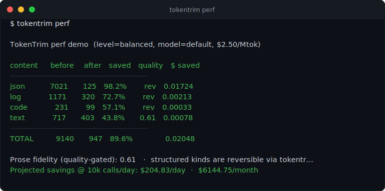

# TokenTrim

**The context compression layer for AI agents.**

TokenTrim compresses everything your AI agent reads — tool outputs, logs, RAG chunks, files, and conversation history — *before* it reaches the LLM. Same answers, a fraction of the tokens.

- **60–95% fewer tokens** on real agent workloads (logs, JSON dumps, large files).
- **Quality gate** — a fidelity check reverts lossy prose compression to the original if the answer would be lost. Compress hard, never silently.
- **Dedup engine** — collapses exact + near-duplicate blocks and re-pasted messages (conversations are ~70% redundant).
- **Cost accounting** — every result reports dollars saved using per-model pricing; the proxy can skip identical LLM calls entirely.
- **Local-first** — your data never leaves the machine. The core has **zero runtime dependencies**.
- **Reversible (CCR)** — originals are cached locally and recoverable on demand via a reference id.
- **Three ways to run** — Python library, drop-in chat-completions proxy, or MCP server.
- **Structure-aware** — separate compressors for JSON, code (AST), logs, diffs, tables, and prose.

> Author: **Sam Gupta** · License: Apache-2.0
>
> Builds on established ideas in context compression — reversible caching, content-type routing, quality-gated pruning, and answer-token retention — with a fully dependency-free core, deterministic/testable compressors, a fidelity-based quality gate, a SimHash/sequence dedup engine, built-in secret redaction, a TF-IDF RAG ranker, transparent cost accounting, and a reference-based reversible store.

## Why use this?

**The problem it solves.** Most of what an AI agent reads is *low-density* — 5,000 identical log heartbeats around one `FATAL`, a 200-record JSON dump where 3 rows matter, a whole file when only the signatures do. That redundancy burns tokens, dollars, and latency on every call.

**60-second quickstart.**
```bash
pipx install "git+https://github.com/sam00/AI-TokenTrim.git"
tokentrim perf       # see the savings on sample workloads
tokentrim doctor     # confirm install, extras, and config
```

**Example output (`tokentrim perf`).** Real numbers on the bundled sample workloads:



**Who it's for.** Teams shipping LLM agents/apps who want lower bills and more usable context — usable as a Python library, a drop-in OpenAI-compatible proxy, or an MCP server.

**What it is *not*.** Not a hosted service and not a model. It runs **locally** with a zero-dependency core, and compression is **reversible** — originals are cached and recoverable by reference id.

### Three focus areas

| Focus | What we do |
| --- | --- |
| **Quality output** | A fidelity score (important-token recall) gates lossy prose compression — if the answer would be lost, the original is sent instead. Structured kinds stay reversible. |
| **Token reduction** | Content-aware compressors **plus** an exact + near-duplicate dedup engine (re-pasted files, repeated tracebacks, redundant messages) and a TokenOpt whitespace/markdown pass. |
| **Cost reduction** | Per-model pricing turns token savings into dollar savings; the proxy can skip identical LLM calls with an exact-match response cache. |

---

## The problem in one picture

Every token your agent reads costs money and latency, and crowds the context window. Most of what agents read is *low-density*: 5,000 lines of identical log heartbeats around one `FATAL`, a 200-record JSON dump where 3 rows tell the story, an entire source file when only the signatures matter.

TokenTrim keeps the signal and drops the redundancy — losslessly recoverable when it isn't.

```
Your agent / app  (any IDE, agent, or framework)
        │  prompts · tool outputs · logs · RAG results · files
        ▼
┌──────────────────────────────────────────────┐
│ TokenTrim  (runs locally)              │
│  redact → route → compress → cache(CCR)       │
│   ├─ SmartCrusher     (JSON / JSONL)          │
│   ├─ CodeCompressor   (Python AST + generic)  │
│   ├─ LogCompressor    (template dedup)        │
│   ├─ RagCompressor    (TF-IDF rank + extract) │
│   └─ TextCompressor   (extractive salience)   │
└──────────────────────────────────────────────┘
        │  compressed prompt + retrieval marker
        ▼
   Your LLM provider  (hosted API · local · …)
```

---

## Install

TokenTrim installs from this repo today (PyPI publish pending):

```bash
# Global CLI — recommended for MCP / proxy (isolated, puts `tokentrim` on PATH)
pipx install "git+https://github.com/sam00/AI-TokenTrim.git"

# Into your project / venv (library use)
pip install "git+https://github.com/sam00/AI-TokenTrim.git"

# With extras
pip install "tokentrim[mcp]   @ git+https://github.com/sam00/AI-TokenTrim.git"   # MCP server
pip install "tokentrim[proxy] @ git+https://github.com/sam00/AI-TokenTrim.git"   # proxy
pip install "tokentrim[all]   @ git+https://github.com/sam00/AI-TokenTrim.git"   # everything
```

Once published to PyPI this is simply `pip install tokentrim` (plus `[mcp]`,
`[proxy]`, `[tokens]`, `[all]`).

Requires **Python 3.9+**. After installing, wire up your IDE and verify in two commands:

```bash
tokentrim setup                           # prints the MCP config entry (add --write --config-path <FILE> to merge)
tokentrim doctor                          # confirms install, extras, and config
```

New here? Run `tokentrim quickstart` for copy-paste steps.

---

## Quick start

### 1. Library

```python
from tokentrim import compress_block, compress, compress_rag, retrieve

# Compress one block (a tool output, a file, a log dump)
result = compress_block(open("huge_server.log").read())
print(result.text)                  # compressed, with a [tokentrim:ref …] marker
print(result.ratio)                 # e.g. 0.88  → 88% fewer tokens
original = retrieve(result.ref)     # recover the full original on demand

# Compress a whole chat history before sending to the LLM
messages = compress(messages, keep_last=4)

# Compress RAG chunks against the user's query
kept = compress_rag(chunks, query="how does billing retry failed charges?")
```

### 2. Proxy (zero code changes)

```bash
tokentrim proxy --port 8787 --upstream <your-provider>/v1
```

Point your client's base URL at `http://127.0.0.1:8787/v1`. Every
`/v1/chat/completions` request is compressed before forwarding; the response
streams straight back with an `x-tokentrim-tokens-saved` header.

### 3. MCP server

```bash
tokentrim setup                                # prints the MCP config entry
tokentrim setup --write --config-path <FILE>   # …or merge it into your client's config
# …or run the server directly:
tokentrim mcp
```

Exposes `tokentrim_compress`, `tokentrim_retrieve`, and `tokentrim_stats` to any
MCP client. `tokentrim setup` resolves and fills in the absolute path for you; see
[`REQUIREMENTS.md`](./REQUIREMENTS.md) for manual setup.

### See the savings

```bash
tokentrim perf
```

```
TokenTrim perf demo  (level=balanced, model=default, $2.50/Mtok)

content     before    after   saved   quality   $ saved
-------------------------------------------------------
json          7021      125   98.2%       rev   0.01724
log           1171      320   72.7%       rev   0.00213
code           231       99   57.1%       rev   0.00033
text           717      403   43.8%      0.61   0.00078
-------------------------------------------------------
TOTAL         9140      947   89.6%             0.02048

Projected savings @ 10k calls/day: $204.83/day  ·  $6144.75/month
```

---

## How it works

1. **Redact** — secrets (API keys, tokens, private keys) are masked first, so credentials never enter a compressed prompt.
2. **Route** — `ContentRouter` classifies the payload (JSON / code / log / diff / table / text) with cheap heuristics.
3. **Dedup** — exact + near-duplicate blocks collapse (SimHash + sequence ratio); across a conversation, re-pasted messages become back-pointers.
4. **Compress** — the matching compressor crushes the content:
   - **SmartCrusher** collapses record arrays into *shape + samples + count*.
   - **CodeCompressor** keeps imports, signatures, and docstrings; elides bodies (Python via `ast`).
   - **LogCompressor** templates lines, collapses `× N` duplicates, and always preserves errors + context.
   - **RagCompressor** ranks chunks by TF-IDF cosine to the query and keeps only the relevant ones.
   - **TextCompressor** ranks sentences by salience, keeps the top set in order, and runs a TokenOpt whitespace/markdown pass.
5. **Quality gate** — a fidelity score (important-token recall) is measured. For lossy **prose** (text/table), if it drops below `quality_threshold`, the original is sent instead. Structured kinds are exempt (reversible + structural).
6. **Cache (CCR)** — the original is stored locally keyed by a short reference; the compressed block carries a `[tokentrim:ref …]` marker so an agent can call `tokentrim_retrieve` if it needs the full text.
7. **Account** — token savings are converted to dollars via per-model pricing and recorded in telemetry.

Everything is **deterministic** and **degrades safely**: malformed input or content that wouldn't shrink (or wouldn't keep enough of the answer) is passed through unchanged.

---

## Configuration

All settings are optional and resolved as `kwargs > env vars > defaults`. See [`.env.example`](./.env.example).

| Env var | Default | Meaning |
| --- | --- | --- |
| `TOKENTRIM_ENABLED` | `1` | Master on/off switch |
| `TOKENTRIM_LEVEL` | `balanced` | `light` \| `balanced` \| `aggressive` |
| `TOKENTRIM_MIN_TOKENS` | `300` | Skip content smaller than this |
| `TOKENTRIM_REDACT_SECRETS` | `1` | Mask secrets before compressing |
| `TOKENTRIM_QUALITY_THRESHOLD` | `0.35` | Min prose fidelity to accept lossy compression (0 disables) |
| `TOKENTRIM_DEDUP` | `1` | Collapse exact + near-duplicate blocks/messages |
| `TOKENTRIM_NORMALIZE_WHITESPACE` | `1` | TokenOpt: strip markdown emphasis / collapse whitespace |
| `TOKENTRIM_TOKENIZER` | `heuristic` | `heuristic` \| `tiktoken` |
| `TOKENTRIM_MODEL` | `default` | Model/tier name for cost estimates / tiktoken |
| `TOKENTRIM_STORE_DIR` | `.tokentrim/store` | CCR cache location |
| `TOKENTRIM_STORE_TTL` | `86400` | Seconds to keep recoverable originals |
| `TOKENTRIM_UPSTREAM_BASE_URL` | _(required for proxy)_ | Proxy upstream, e.g. `<your-provider>/v1` |
| `TOKENTRIM_PROXY_HOST` / `_PORT` | `127.0.0.1` / `8787` | Proxy bind address |
| `TOKENTRIM_CACHE_RESPONSES` | `0` | Proxy exact-match response cache (skip identical LLM calls) |

```python
from tokentrim import Config, set_config
set_config(Config(level="aggressive", min_tokens=200))
```

---

## CLI

```
tokentrim compress [PATH]   Compress a file or stdin (savings printed to stderr)
tokentrim perf              Run the built-in savings demo
tokentrim retrieve REF      Recover an original from the CCR store
tokentrim stats             Show in-process telemetry as JSON
tokentrim proxy             Run the compressing chat-completions proxy
tokentrim mcp               Run the MCP server over stdio
tokentrim version           Print version
```

---

## Capabilities

| | Typical compressor | TokenTrim |
| --- | --- | --- |
| Core dependencies | several (ML extras) | **none** (pure stdlib) |
| Reversible store | CCR | CCR via short reference ids |
| RAG relevance | optional extra | **built-in** TF-IDF ranker |
| Secret redaction | — | **built-in**, pre-compression |
| Quality gate | — | **built-in** fidelity gate (reverts lossy prose) |
| Dedup (near-dup) | — | **built-in** SimHash + sequence-ratio engine |
| Cost accounting | — | **built-in** per-model $ savings |
| Response cache | — | **built-in** exact-match cache in proxy |
| Determinism | model-dependent | **fully deterministic** |
| Token counting | tokenizer required | heuristic by default, tiktoken optional |

---

## Development

```bash
pip install -e ".[dev]"
pytest                # run the test suite
ruff check src tests  # lint
tokentrim perf        # token + cost savings demo
```

- [`INTRODUCTION.md`](./INTRODUCTION.md) — what it is, full capability tour, and how it compares to other tools.
- [`CONTRIBUTING.md`](./CONTRIBUTING.md) — how to contribute.
- [`REQUIREMENTS.md`](./REQUIREMENTS.md) — full product/engineering spec, prerequisites, setup, and IDE integration guide.
- [`PUBLISHING.md`](./PUBLISHING.md) — step-by-step guide to publish this repo to GitHub (and optionally PyPI).
- [`CHANGELOG.md`](./CHANGELOG.md) — release notes.

## Related projects

Part of a small suite of local-first AI-security tools:

- **[AI-RedEye-harness](https://github.com/sam00/AI-RedEye-harness)** — Agentic SAST harness for AI-assisted vulnerability discovery with grounding, voting, SARIF, and CI/CD workflows.
- **[AI-RedTeam-skill](https://github.com/sam00/AI-RedTeam-skill)** — Authorized AI red-team planning skill and framework mapper for MITRE ATT&CK, ATLAS, OWASP LLM Top 10, and NIST AI RMF.

## License

Apache-2.0 © 2026 Sam Gupta
